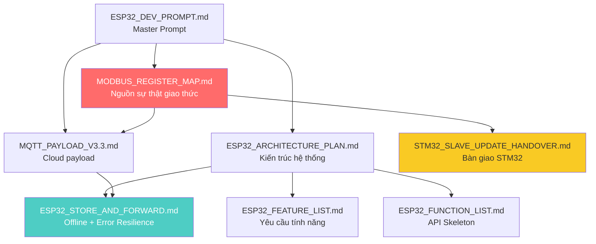

# 📘 TRU_V1.0 — TÀI LIỆU CĂN CỨ TRIỂN KHAI DỰ ÁN
## ESP32 Gateway Trạm Sạc Điện (BL_GW_ESP32_Ver2.2)

**Phiên bản tài liệu:** Rev 2.0 — FINAL  
**Ngày đóng băng:** 31/03/2026  
**Trạng thái:** 🔒 **LOCKED** — Hạn chế sửa đổi. Mọi thay đổi sau ngày này phải tạo Addendum riêng.

---

## 1. TỔNG QUAN DỰ ÁN

### 1.1. Mục tiêu
Xây dựng Firmware cho **ESP32-WROVER-B** (8MB Flash, 4MB PSRAM) đóng vai trò **IoT Gateway & Modbus RTU Master**, kết nối các trụ sạc STM32 (Slave) với Cloud Server qua MQTT, hỗ trợ cấu hình nội bộ qua Web Dashboard.

### 1.2. Phần cứng
| Thành phần | Chi tiết |
|-----------|---------|
| MCU | ESP32-WROVER-B (Dual-core Xtensa LX6, 240MHz) |
| Flash | 8MB (partition table custom, xem Architecture Plan) |
| PSRAM | 4MB (SPIRAM, dùng cho JSON buffer lớn, OTA download) |
| Ethernet | LAN8742A PHY (RMII, 25MHz crystal tại GPIO0) |
| RS485 #1 | ISO3082DWR / MAX3485 (UART1: TX=GPIO17, RX=GPIO16, DE=GPIO14) |
| RS485 #2 | Dự phòng (UART2: TX=GPIO15, RX=GPIO36, DE=GPIO13) |
| RTC | DS1307 (I2C: SCL=GPIO32, SDA=GPIO33) |
| LED Status | GPIO5 (qua MMBT3904) |
| Nút nhấn | GPIO34 (5s=AP cấu hình, 10s=Factory Reset) |

### 1.3. Công nghệ
| Hạng mục | Lựa chọn |
|----------|----------|
| Framework | **ESP-IDF v5.x** (C11 native, KHÔNG dùng Arduino) |
| JSON | cJSON (built-in ESP-IDF) |
| MQTT | esp_mqtt (built-in, TLS/SSL support) |
| HTTP Server | esp_http_server + WebSocket |
| Filesystem | LittleFS (thay SPIFFS, reliable hơn khi power-loss) |
| Build System | CMake + idf.py |
| IDE | PlatformIO / VSCode (khuyến nghị) |

---

## 2. DANH SÁCH TÀI LIỆU KỸ THUẬT

> [!IMPORTANT]
> Tất cả tài liệu bên dưới nằm trong thư mục `docs/` và là **căn cứ duy nhất** cho việc triển khai code. Khi có mâu thuẫn giữa các file, ưu tiên theo thứ tự: Register Map → MQTT Payload → Architecture → Feature/Function.

### 2.1. Bảng tổng hợp

| # | File | Rev | Kích thước | Nội dung chính |
|---|------|-----|-----------|----------------|
| 1 | [ESP32_DEV_PROMPT.md](file:///home/nxchieu/projects/Minhnt_charger_Master/ESP32_DEV_PROMPT.md) | 2.0 | ~5KB | **Master Prompt** — Tóm tắt tổng quan toàn bộ yêu cầu dự án, dùng làm context cho AI coding |
| 2 | [MODBUS_REGISTER_MAP.md](file:///home/nxchieu/projects/Minhnt_charger_Master/docs/MODBUS_REGISTER_MAP.md) | 2.0 | ~9KB | **Nguồn sự thật** — Bảng register Modbus RTU đầy đủ (45 Input, 8 Discrete, 7 Coils, 14 Holding), FSM enum, Error types, Protocol specs |
| 3 | [MQTT_PAYLOAD_V3.3.md](file:///home/nxchieu/projects/Minhnt_charger_Master/docs/MQTT_PAYLOAD_V3.3.md) | 3.4 | ~12KB | Cấu trúc JSON payload MQTT — 7 topic types (gw_status, tlm, status, evt, cmd, cmd_ack, ota_progress), enum tables |
| 4 | [ESP32_ARCHITECTURE_PLAN.md](file:///home/nxchieu/projects/Minhnt_charger_Master/docs/ESP32_ARCHITECTURE_PLAN.md) | 2.0 | ~10KB | Kiến trúc phần mềm — Component structure, FreeRTOS tasks (7 tasks), Partition table 8MB (64KB aligned), sdkconfig, 6-phase plan |
| 5 | [ESP32_FEATURE_LIST.md](file:///home/nxchieu/projects/Minhnt_charger_Master/docs/ESP32_FEATURE_LIST.md) | 2.0 | ~6KB | Danh sách 30+ tính năng — NET, MOD, IOT, OTA, STF, WEB, SYS, HW |
| 6 | [ESP32_FUNCTION_LIST.md](file:///home/nxchieu/projects/Minhnt_charger_Master/docs/ESP32_FUNCTION_LIST.md) | 2.0 | ~10KB | API Skeleton — 9 modules, ~40 hàm, ESP-IDF native signatures, code pattern |
| 7 | [ESP32_STORE_AND_FORWARD.md](file:///home/nxchieu/projects/Minhnt_charger_Master/docs/ESP32_STORE_AND_FORWARD.md) | 1.0 | ~27KB | **Tài liệu dày nhất** — Binary block 64 bytes, MQTT sync flags, replay logic, 10 bảng bad-case, 9 bài học GELEX production, sdkconfig hardening |
| 8 | [STM32_SLAVE_UPDATE_HANDOVER.md](file:///home/nxchieu/projects/Minhnt_charger_Master/docs/STM32_SLAVE_UPDATE_HANDOVER.md) | 1.0 | ~8KB | Bàn giao STM32 — Yêu cầu update Slave firmware, priority, test checklist |

### 2.2. Sơ đồ quan hệ giữa tài liệu



---

## 3. QUY HOẠCH BỘ NHỚ FLASH 8MB

```
┌──────────────────────────────────────────────┐ 0x000000
│  Bootloader (16KB)                            │
├──────────────────────────────────────────────┤ 0x009000
│  NVS — Config, Cert, Password (24KB)          │
├──────────────────────────────────────────────┤ 0x00F000
│  OTA Data — Boot pointer (8KB)                │
├──────────────────────────────────────────────┤ 0x011000
│  PHY Init — RF calibration (4KB)              │
├──────────────────────────────────────────────┤ 0x020000
│                                               │
│  OTA_0 — Firmware chính (2.5MB, 40×64K)       │
│                                               │
├──────────────────────────────────────────────┤ 0x2A0000
│                                               │
│  OTA_1 — Firmware backup (2.5MB, 40×64K)      │
│                                               │
├──────────────────────────────────────────────┤ 0x520000
│  WWW — Web Dashboard SPA (768KB, 12×64K)      │
├──────────────────────────────────────────────┤ 0x5E0000
│                                               │
│  STORAGE — Offline queue + data (1.75MB,28×64K)│
│  ├── /queue/*.bin (binary blocks 64 bytes)    │
│  ├── /config_backup.json                      │
│  ├── /session_cache.bin                       │
│  └── /ota_state.json                          │
│                                               │
├──────────────────────────────────────────────┤ 0x7A0000
│  WDT_LOG — Crash/reset logs (128KB, 2×64K)    │
├──────────────────────────────────────────────┤ 0x7C0000
│  COREDUMP — Binary crash dump GDB (256KB,4×64K)│
└──────────────────────────────────────────────┘ 0x800000 (8MB)
```

> Tất cả phân vùng data có kích thước là bội số 64KB. Storage capacity: 28,672 records × 64 bytes = ~24 giờ offline.

---

## 4. KIẾN TRÚC FREERTOS — 7 TASKS

| # | Task | Stack | Pri | Core | Chu kỳ | Module |
|---|------|-------|-----|------|--------|--------|
| 1 | `task_modbus_polling` | 4096 | 5 | Core 1 | 1s | modbus_master |
| 2 | `task_modbus_heartbeat` | 2048 | 4 | Core 1 | 3s | modbus_master |
| 3 | `task_mqtt_publish` | 8192 | 3 | Core 0 | Event | cloud_service |
| 4 | `task_mqtt_subscribe` | 4096 | 3 | Core 0 | Block | cloud_service |
| 5 | `task_webserver` | 8192 | 2 | Core 0 | Async | web_ui |
| 6 | `task_system_monitor` | 2048 | 1 | Core 0 | 10s | system_monitor |
| 7 | `task_time_sync` | 2048 | 1 | Core 0 | 60s | time_manager |

> Modbus tasks pin Core 1 để không bị ảnh hưởng bởi WiFi/networking stack trên Core 0.

---

## 5. GIAO THỨC TRUYỀN THÔNG

### 5.1. Modbus RTU (ESP32 ↔ STM32)
- 9600-8N1 qua RS485
- Master poll 45 Input Registers (FC04) mỗi 1s
- Heartbeat FC06 vào HR 0x0109 mỗi 3s
- 7 Coils (FC05) cho điều khiển
- 14 Holding Registers (FC03/06/16) cho cấu hình
- Chi tiết: `MODBUS_REGISTER_MAP.md`

### 5.2. MQTT V3.4 (ESP32 ↔ Server)
- TLS/SSL Port 8883 (cert CA trong NVS)
- 7 topic types: gw_status, tlm, status, evt, cmd, cmd_ack, ota_progress
- RETAIN=true cho event/status/gw_status
- QoS 0 cho TLM, QoS 1 cho EVT/STATUS
- Chi tiết: `MQTT_PAYLOAD_V3.3.md`

### 5.3. WebSocket (ESP32 ↔ Dashboard)
- Port 80, endpoint `/ws`
- Push realtime data mỗi 1s
- REST API cho config/control/diagnostics

---

## 6. CƠ CHẾ BẢO MẬT & ĐỘ TIN CẬY

| Cơ chế | Mô tả | Tài liệu chi tiết |
|--------|-------|-------------------|
| **Ethernet-First** | LAN8742A là kết nối duy nhất. Wi-Fi AP chỉ bật thủ công (nút GPIO34, 5s) | Feature List [NET-02] |
| **TLS/SSL MQTT** | mbedTLS, CA cert trong NVS, asymmetric content length (tiết kiệm 12KB RAM) | Store-and-Forward §8 |
| **OTA Dual A/B** | 2 partition firmware, rollback tự động nếu crash trong 60s | Feature List [OTA-03] |
| **Boot-Loop Protection** | Safe Mode sau 5 lần crash liên tiếp (< 30s mỗi lần) | Store-and-Forward §7.1 |
| **Store-and-Forward** | Binary block 64B, MQTT sync flags, 28K records, FIFO replay | Store-and-Forward §1-5 |
| **Command Validation** | 6-layer Guard (null → JSON → field → stale → rate limit → range) | Store-and-Forward §4.2 |
| **Modbus Resilience** | 3-strike offline, CRC bounds check, UART flush, graceful degradation | Store-and-Forward §4.3, §7.6 |
| **Heap Protection** | 20KB threshold, PSRAM overflow, cJSON chunked | Store-and-Forward §4.5, §7.8 |
| **Web Auth** | Admin password trong NVS, session cookie | Feature List [WEB-06] |

---

## 7. HẠ TẦNG HỖ TRỢ

| Dịch vụ | Địa chỉ | Ghi chú |
|---------|---------|---------|
| MQTT Broker | 10.25.7.116:1883 (EMQX Docker) | TLS: port 8883 |
| OTA Server | 10.25.7.116:8099 | API: `/ota/check`, `/ota/download` |
| OTA Domain | `https://nxchieu.duckdns.org/ota/check` | SSL Let's Encrypt, Nginx reverse proxy |
| EMQX Dashboard | 10.25.7.116:18083 | Quản trị MQTT broker |
| Monitoring | Grafana 10.25.7.116:3100, Prometheus :9090 | Node Exporter :9100 |

---

## 8. TRÌNH TỰ TRIỂN KHAI (6 PHA)

| Pha | Nội dung | Verify |
|-----|----------|--------|
| **1. Foundation** | Project setup, `partitions.csv`, `board_hal.h`, `project_common.h`, Ethernet RMII, RTC I2C, LED/Button | Ping qua LAN, RTC đúng giờ |
| **2. Modbus** | UART driver, FC04/05/06/16, polling task, heartbeat task, event posting | Đọc data STM32 qua RS485 |
| **3. MQTT + S&F** | esp_mqtt client, TLS, offline queue, event-driven publish, cmd_ack | Publish TLM, rút LAN → queue → cắm → replay |
| **4. Web UI** | React/Vanilla SPA (Vite), LittleFS mount, HTTP + WebSocket + REST API | Dashboard trên IP LAN |
| **5. OTA + Monitor** | HTTPS OTA, dual partition, rollback, WDT, crash log, heap tracking | Flash firmware lỗi → auto rollback |
| **6. Testing** | 10 Slaves × 24h stress test, memory leak, CRC error rate, S&F 1h offline | Tất cả metrics ổn định |

---

## 9. LỊCH SỬ PHIÊN BẢN TÀI LIỆU

| Ngày | Rev | Tác giả | Thay đổi |
|------|-----|---------|----------|
| 31/03/2026 | 1.0 | AI + NXC | Bộ tài liệu ban đầu (DEV_PROMPT, Architecture, Feature, Function, Register Map, MQTT V3.3) |
| 31/03/2026 | 2.0 | AI + NXC | **Major update:** Fix FSM enum mismatch, thêm 7 Input Regs + 4 Holding Regs + 2 Coils + 3 Error Types. Thêm OTA, Store-and-Forward (64B binary blocks), System Monitor, cmd_ack, WebSocket. Chuyển ESP-IDF native. Partition aligned 64KB. Bổ sung 9 bài học GELEX production. Tạo bàn giao STM32. |

---

> 🔒 **ĐÓNG BĂNG TÀI LIỆU:** Phiên bản Rev 2.0 là căn cứ chính thức để triển khai code. Mọi thay đổi phát sinh sau ngày 31/03/2026 phải được ghi nhận dưới dạng **Addendum** (tài liệu bổ sung) kèm lý do, không sửa trực tiếp lên các file gốc.
